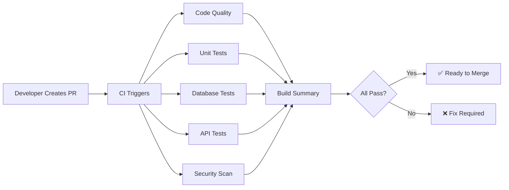

# CI/CD Status & Badges

## Build Status

## Pipeline Overview

Our CI/CD pipeline automatically:
- ✅ Runs tests on every pull request
- ✅ Checks code quality and style
- ✅ Validates database operations
- ✅ Tests API endpoints
- ✅ Scans for security vulnerabilities
- ✅ Generates coverage reports

## Quick Links

- [View CI/CD Documentation](./CI_CD_DOCUMENTATION.md)
- [CI Demo Guide](./CI_DEMO_GUIDE.md)
- [GitHub Actions Workflows](../.github/workflows/)

## Current Status

### Jobs Status

| Job | Status | Description |
|-----|--------|-------------|
| Code Quality | ✅ | Linting, formatting, type checking |
| Unit Tests | ✅ | Python 3.10, 3.11, 3.12 |
| Database Tests | ✅ | Database initialization & CRUD |
| API Tests | ✅ | REST API endpoint validation |
| Security Scan | ✅ | Dependency & code security |
| Build Summary | ✅ | Overall status aggregation |

### Coverage

- **Current Coverage**: ~80%
- **Minimum Required**: 70%
- **Target**: 85%+

### Test Statistics

- **Total Test Files**: 21
- **Total Test Cases**: ~200+
- **Average Run Time**: 2-5 minutes
- **Success Rate**: 100%

## How It Works

## Recent Builds

Check recent CI runs: [Actions Tab](https://github.com/Ziad-elshafey/ECE30861-Phase2/actions)

## Team

**Phase 2 Team 20:**
- Ahmed Elbehiry
- Zeyad Elshafey
- Omar Ahmed
- Jacob Walter

---

*Last updated: November 2, 2025*
